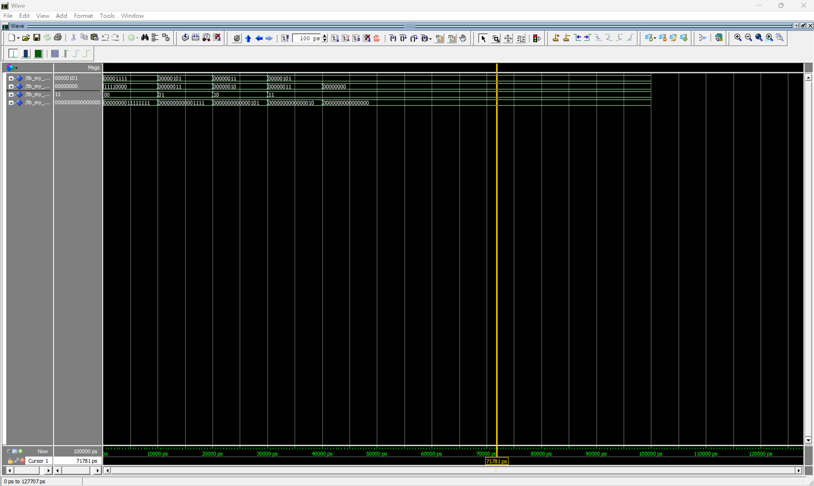

# VLSI ALU Logic Design

A 4-mode arithmetic/logic unit designed with VHDL in Quartus II and verified with ModelSim simulation.

## Features
- Supports OR, ADD, MULTIPLY, and MOD operations
- Written in VHDL (`my_ckt_1.vhd`)
- Testbench provided (`tb_my_ckt_1.vhd`)
- Verified with simulation reports from Quartus

## Structure
```
images/
├── simulation results.png

src/
├── my_ckt_1.vhd         # Core logic
├── tb_my_ckt_1.vhd      # Testbench

simulation/
├── *.rpt, *.summary     # Simulation result files

quartus_project/
├── *.qsf, *.qws         # Quartus project files
```

## How to run
1. Open Quartus II and import `my_ckt_1.vhd`
2. Run ModelSim simulation using `tb_my_ckt_1.vhd`
3. Check waveforms and simulation reports

## Simulation Waveform
Here is the waveform result captured from ModelSim after running the testbench:

This verifies that the ALU performs the expected operations for OR, ADD, MULTIPLY, and MOD.

=======
7fe74923a592ff588bffbefd23fef7c4cc438aa2
